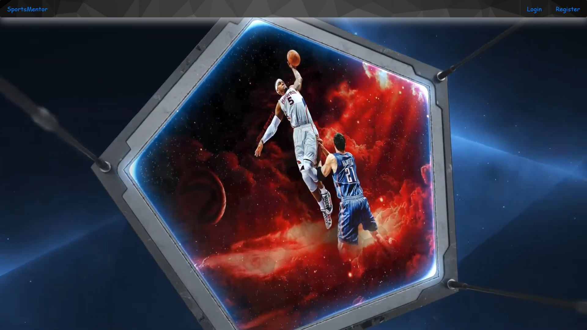

# SportsMentor

## Description
As developers we created a MERN application, the application will allow users to watch and learn how to play different sports. Users will be able to register an account with their email and password. Then they will be taken to the StudyUp page where they will see cards for different sports, when they click on one of them they will be taken to the tutorial page for that specific sport where they can read about the tecniques for that sport as well as to watch videos for those tecniques so they can practice them. Each card has a save button which when they hit it will save that card in the user's dashboard. In the users dashboard they will be able to see the cards they saved from the studyUp page and when they finish with that specific sport they can hit the complete button which will change the card to green color, meaning that they are done with that sport. The application's UI is divided into components, manage component state, and respond to user events.  


## Available Scripts

In the project directory, you can run:

### `npm run dev`

Runs the app in the development mode.<br />
Open [http://localhost:3000](http://localhost:3000) to view it in the browser.

The page will reload if you make edits.<br />
You will also see any lint errors in the console.
 
## Screenshot 


## Directory structure
```
.
├── client
|
├── config
│ 
├── controllers
│
├── middleware
│    
├── models   
│    
├── node_modules   
│    
├── routes  
│    
├── seeds   
│    
├── .env            
│          
├── package.json 
│
├── README.md 
│
└── server.js
```

## Links to deployed app


https://github.com/eradicador/sportsmentor


## Badge


## License

MIT License

Copyright (c) [2020] [Michael Amaya and Derek D'Esposito]

Permission is hereby granted, free of charge, to any person obtaining a copy
of this software and associated documentation files (the "Software"), to deal
in the Software without restriction, including without limitation the rights
to use, copy, modify, merge, publish, distribute, sublicense, and/or sell
copies of the Software, and to permit persons to whom the Software is
furnished to do so, subject to the following conditions:

The above copyright notice and this permission notice shall be included in all
copies or substantial portions of the Software.

THE SOFTWARE IS PROVIDED "AS IS", WITHOUT WARRANTY OF ANY KIND, EXPRESS OR
IMPLIED, INCLUDING BUT NOT LIMITED TO THE WARRANTIES OF MERCHANTABILITY,
FITNESS FOR A PARTICULAR PURPOSE AND NONINFRINGEMENT. IN NO EVENT SHALL THE
AUTHORS OR COPYRIGHT HOLDERS BE LIABLE FOR ANY CLAIM, DAMAGES OR OTHER
LIABILITY, WHETHER IN AN ACTION OF CONTRACT, TORT OR OTHERWISE, ARISING FROM,
OUT OF OR IN CONNECTION WITH THE SOFTWARE OR THE USE OR OTHER DEALINGS IN THE
SOFTWARE.

## Contributing
[](code_of_conduct.md)


